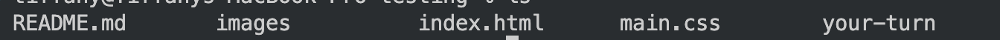

Let's code this 💪

## Fork and Clone this Repo

Follow these steps to start developing locally on this repository!

1. Fork the repository using the "Fork" button on the top-right part of the page.

2. Once the repository is forked, clone it by running the following command in your terminal:

```
git@github.com:<your-username>/github-demo.git
```

3. Set this repository as a git remote:
```
git remote add upstream git@github.com:STEM-ENRG/github-demo.git
```

4. Make sure you're in the directory of the project
```
ls
```
The response should have these contents


If you don't see that, then you'll need to navigate to the correct directory/folder
`cd github-demo` then `ls` to check again to verify your directory looks like the above image

5. Open the html file in your browser
```
open index.html
```
This command should open in a browser

## Contribute
1. Create a new branch:
```
git checkout -b <your-branch-name>
```

2. Implement your changes and commit them to the branch.

3. Push to your forked repo:
```
git push -u origin <your-branch-name>
```

4. [Create a new pull request on this repository](https://docs.github.com/en/github/collaborating-with-issues-and-pull-requests/creating-a-pull-request)

<h2>CONGRATS - YOU DID IT</h2>
